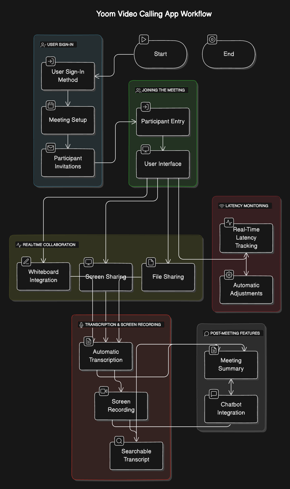

# Yoom App :- (Ultimate Video calling App)

Yoom is a all in one video calling App..
 It is powerful virtual collaboration platform designed for seamless online meetings , Communication which makes it more productive and efficient. It offering a range of features designed to make online meetings more productive and user-friendly. It is good for both small teams and large-scale events.It features an interactive whiteboard, smart chatbot with context, automatic transcription, and chat history for ongoing discussions. Users can share files up to 250MB, track latency for smooth meetings, and access past recordings. With scalability for up to 100,000 participants and screen sharing support, Yoom makes virtual collaboration efficient and effortless.

## Feature of the app
1. **Scalable Video Calling**: Supports seamless video calls, scalable for large groups with minimal latency upto 10000.
2. **AI Chatbot:-** A build-in AI assistant that can answer questions or provide meeting context post meeting , acting like a meeting secretary.

3. **Transcription Feature**: The person or participants can get Transcript during the post meeting.
4. **Post meeting Recordings**: Post meeting recording  can be seen. It favours the ones who missed the entire and some parts of the meeting by any reason.

5. **Higly Scalable**: Our Yoom App is very scalable it can accomodate 1 lakh people in a single video call.

6. **Screen Sharing**: It is the feature through which we can show the personal work in the device of any particular person.
7. **File Sharing** :- Files upto 250 mb can be sent on the chat of the meeting to offer seamless file sharing during meetings.
8. **Latency Tracking**:-Monitoring network Latency ensure smooth communication and quick resolution of any delay

## USP of our App

### 1. Post meeting Ai Chatbot
An ability to retrieve all the context and information related to the meeting is very useful in the case where an important person taking or appearing in the meeting has to deliver their content , Fast and Crisp. So a normal person misses out any details  have the feature to retrieve screen recordings, transcription and chat with Ai-chatbot to retrieve context of the meetings.

### 2. Whiteboard implementation
It is very crucial as it offers seamless  virtual communication b/w the participants. 

### 3. File Sharing & Latency Tracking:-
It is the cherry on top that leverage our app for user seamless translation from sharing video , images , Files to effectively monitor network issues dynamically.

## Workflow Diagram

## Teck Stack :- 

### Machine learning:-

1. Streamlit
2. Assembly Ai
3. Langchain
4. OpenAi Models

### Full Stack:-
1. ShadCN
2. mongoDB
3. tailwind CSS
4. NextJS
5. WebRTC

## Demo of our Website

### Home Page

### About Yoom

### Features

### Yoom Meeting Roadmap

### Dashboard

### Working Demo:-
This is the working demo of our app which providing every context of the metting and the result can be taken in many languages upto 30+

## APP Link
https://yoom-htm.vercel.app
